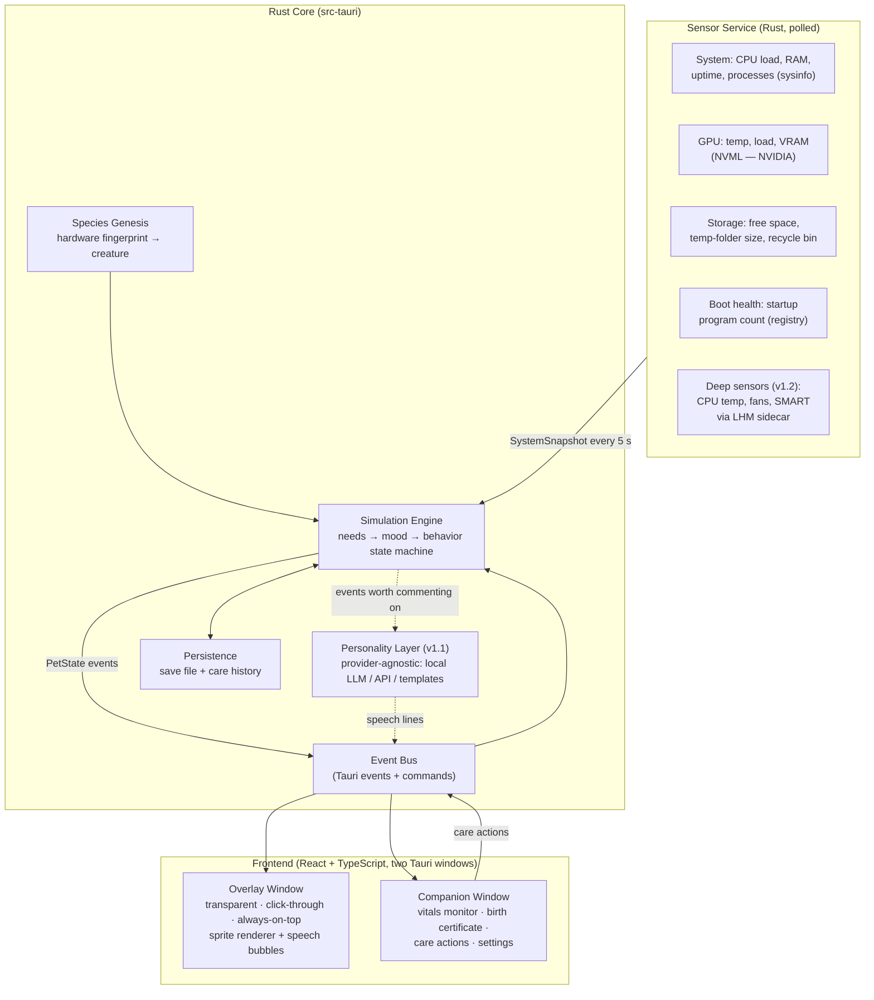

# Byteling — Architecture

> **Byteling** is a desktop creature whose body, mood, and health are a living reflection
> of your actual PC. Your hardware determines the species that hatches. Your maintenance
> habits determine how it grows. Caring for the pet *is* caring for the machine.

**Status:** initial architecture (pre-v1) · **Platform:** Windows 10/11 first · **License:** MIT

---

## 1. Product pillars

Every design decision must serve at least one of these:

1. **The pet is the PC.** No fake stats. Every mood, animation, and complaint traces back
   to a real sensor reading or system fact.
2. **Utility disguised as care.** Cleaning junk files, rebooting, updating — reframed as
   feeding, resting, and healing. The companion app is a vet clinic, not a dashboard.
3. **Every machine hatches a unique creature.** Hardware fingerprint → deterministic
   species, palette, and temperament. Built-in reason to share screenshots.
4. **Local-first, privacy-respecting.** Zero telemetry. The optional AI personality runs
   locally by default. "Your pet never phones home" is a headline feature.
5. **Lightweight.** A pet that makes the PC sick (high CPU/RAM usage) is a failed pet.
   Budget: < 1% CPU average, < 150 MB RAM total.

---

## 2. High-level architecture

Two visible surfaces, one Rust core:



**Golden rule of the data flow:** sensors never talk to the UI directly. Everything is
normalized into a `SystemSnapshot`, digested by the simulation engine into a `PetState`,
and only *that* is what the frontends render. This keeps the UI dumb, the logic testable,
and lets us fake snapshots in tests and demos.

---

## 3. Tech stack and why

| Layer | Choice | Why |
|---|---|---|
| App shell | **Tauri 2** | Tiny binaries, native webview, first-class multi-window + transparency support, Rust backend. An Electron pet would violate pillar 5. |
| Core logic | **Rust** | Sensor polling, state machine, and persistence with near-zero overhead; also the credibility flex for the README. |
| UI | **React 18 + TypeScript + Vite** | Fast iteration on both windows from one codebase. |
| Animation | **Sprite sheets** (CSS `steps()` / canvas) | Deterministic, cheap, pixel-art friendly. Rive/Lottie considered for v2 cutscenes only. |
| System info | **`sysinfo` crate** | Cross-platform CPU/RAM/disk/uptime/process data, no admin rights needed. |
| GPU | **`nvml-wrapper` crate** | NVIDIA temp/load/VRAM without admin rights. (AMD/Intel: graceful degradation, see §10.) |
| Windows specifics | **`windows` crate (Win32/WMI)** | Recycle-bin size, startup entries, session events. |
| Persistence | **JSON via `serde`** (v1) | One save file + append-only history log. SQLite only if history queries demand it later. |
| AI (v1.1) | **Provider trait**: Ollama (local, default) / user-supplied API key / template fallback | Personality works offline; AI is an enhancement, never a dependency. |
| CI/CD | **GitHub Actions** | fmt + clippy + test on every PR; `tauri-action` builds signed release artifacts on tags. |

---

## 4. Sensor Service

Polls on a background thread (Tokio task), emits a normalized snapshot every **5 seconds**
(cheap sensors) with slow scans (folder sizes, startup entries) refreshed every **5 minutes**
and cached.

```rust
pub struct SystemSnapshot {
    pub timestamp: DateTime<Utc>,
    // Load & memory (sysinfo)
    pub cpu_load_pct: f32,           // 0–100, averaged over cores
    pub ram_used_pct: f32,
    pub process_count: u32,
    pub uptime_hours: f32,
    // GPU (NVML; None on non-NVIDIA)
    pub gpu: Option<GpuReading>,     // temp_c, load_pct, vram_used_pct
    // Storage
    pub system_drive_free_pct: f32,
    pub temp_folder_mb: u64,         // %TEMP% size (cached scan)
    pub recycle_bin_mb: u64,         // SHQueryRecycleBin
    // Boot health
    pub startup_program_count: u32,  // HKCU/HKLM Run keys + Startup folder
    // Deep sensors — v1.2, None until then
    pub cpu_temp_c: Option<f32>,
    pub disk_smart_ok: Option<bool>,
}
```

### The Windows temperature reality (important honesty)

CPU temperature on Windows is **not** reliably readable from user space. WMI's
`MSAcpi_ThermalZoneTemperature` is missing or wrong on most consumer boards, and reading
it properly (like HWiNFO/LibreHardwareMonitor do) requires a kernel driver and admin rights.

**Strategy:**
- **v1:** ship without CPU temp. GPU temp (NVML, no admin needed) + CPU *load* act as the
  "fever" inputs. The 1080 Ti dev machine makes GPU-first convenient to build and test.
- **v1.2:** optional **LHM sidecar** — a tiny C# process embedding
  `LibreHardwareMonitorLib` (MPL-2.0, compatible with MIT app code as a dynamically-used
  component), launched elevated only if the user opts into "Deep Vitals," streaming JSON
  over stdout to the Rust core. If absent or declined, everything degrades gracefully.

This staging is a feature, not a compromise: v1 ships without ever asking for admin rights.

---

## 5. Simulation Engine

The heart of the app. Pure Rust, no I/O, fully unit-testable: `(PetState, SystemSnapshot,
Δt) → PetState`.

### 5.1 Needs

Each need is 0–100 (100 = perfect), derived from sensors with smoothing (EMA) so the pet
doesn't mood-swing on every spike:

| Need | Driven by | Pet-language |
|---|---|---|
| **Comfort** | GPU temp (later CPU temp), sustained load | "I'm burning up!" / fever animation |
| **Space** | System-drive free %, VRAM pressure | "It's getting cramped in here…" |
| **Tidiness** | Temp-folder MB, recycle-bin MB, startup count | Scruffy fur, flies buzzing around it |
| **Rest** | Uptime hours (grogginess ramps after ~7 days) | Yawning, bags under eyes |
| **Energy** | RAM pressure, process count | Sluggish movement at high pressure |

### 5.2 Mood

`mood = weighted blend of needs, dominated by the worst need` — a pet with four perfect
needs and one critical one should visibly suffer from the critical one, not average out
to "fine." Mood bands: **Thriving · Content · Uneasy · Unwell · Critical**.

### 5.3 Behavior state machine

Mood selects a *behavior set*; behaviors are small looping activities the overlay plays:

```
Idle ─► Wander ─► Sit ─► Sleep (uptime-driven) ─► GroomSelf (tidiness) ─►
Shiver/Pant (comfort) ─► Celebrate (triggered: cleanup done, reboot detected) ─► …
```

Transitions are weighted-random within the current mood band, plus **event interrupts**
(care action performed, threshold crossed, session unlock → greeting). The state machine
is data-driven (a table of states, weights, and animation IDs) so adding behaviors never
means touching engine code.

### 5.4 Care actions (companion app → engine)

| Action | What actually happens | Effect |
|---|---|---|
| **Feed / Groom** | Clear %TEMP% + empty recycle bin (with confirmation & summary) | Tidiness ↑, celebrate animation |
| **Tuck in** | Prompt + schedule a reboot | Rest resets after reboot detected |
| **Health check** | Run all slow scans now, show vet-style report | Information only |
| **Play fetch** (v1.2) | Micro GPU benchmark | Fun + a "fitness" stat |

Care actions that touch the user's files are **always confirm-first and always reversible
or transparent** (show exactly what will be deleted and how many MB). Trust is a feature.

### 5.5 Long-term: care history & evolution (v1.2)

Append-only log of daily need averages and care events → a rolling **Care Score** →
evolution stages at ages 7/30/90 days, with the *form* of each evolution chosen by which
needs were best maintained. A neglected Byteling doesn't die (we're kinder than 1996) —
it becomes visibly scruffy and writes passive-aggressive diary entries.

---

## 6. Species Genesis

On first run:

```
fingerprint = SHA-256(cpu_brand + gpu_name + total_ram_gb + os_install_year)
seed        = first 8 bytes of fingerprint
species     = archetype table lookup + trait rolls, all seeded
```

Hardware traits bias the outcome: GPU tier → size/element of the creature; machine age
(OS install year as proxy) → youthful vs. wise temperament; RAM → appetite; core count →
number of visual "whiskers/antennae." Deterministic: the same machine always hatches the
same creature — reinstalling the app reunites you with *your* pet. The seed also drives
the color palette, so screenshots are visually diverse across users.

The hatching sequence (first run) is **the** onboarding moment and the first GIF for the
README: scanning animation → egg forms from spec readouts → hatch → birth certificate.

---

## 7. Frontend surfaces

### 7.1 Overlay window
- Tauri window config: `transparent: true`, `decorations: false`, `alwaysOnTop: true`,
  `skipTaskbar: true`.
- **Click-through by default** (`set_ignore_cursor_events(true)`); a small hit-zone around
  the pet toggles interactivity on hover so you can pet it or drag it, without ever
  stealing clicks from the app underneath.
- Renders sprite sheets on a canvas; listens only to `pet_state_changed` and
  `speech_line` events. Zero logic in the overlay.
- Speech bubbles: rate-limited (max ~1 per 10 min unless the user interacts), dismissible,
  and can be disabled entirely. A pet that nags gets uninstalled.

### 7.2 Companion window
Vet-clinic themed, four tabs:
1. **Vitals** — heartbeat line whose BPM maps to CPU load, thermometer, needs as a
   pentagon chart. Live, driven by the same `PetState` events.
2. **Birth certificate** — species, hatch date, and the machine's specs presented as
   anatomy ("Heart: GTX 1080 Ti · Brain: 32 GB · Skeleton: Windows 11").
3. **Care** — the actions from §5.4 with clear previews of real effects.
4. **Settings** — pet visibility/size, speech frequency, skins (v1.2), AI provider (v1.1),
   launch-at-startup toggle.

---

## 8. AI Personality Layer (v1.1)

Deterministic simulation is the engine; AI is only the **voice**.

```rust
trait PersonalityProvider {
    async fn speak(&self, pet_card: &PetCard, event: &PetEvent) -> Option<String>;
}
// Implementations: OllamaProvider (default), ApiProvider (user key), TemplateProvider (fallback)
```

- `PetCard` = species, temperament traits, current needs, a few recent events. Small,
  stable prompt — cheap even on a 3B local model.
- Triggered only by *notable* events (threshold crossings, care actions, unlock greeting,
  weekly checkup letter), never on a timer. Responses cached per (event-type, mood-band)
  with jittered reuse, so the AI is called at most a handful of times per day.
- If no provider is configured: `TemplateProvider` serves hand-written lines with
  variable slots. The pet is never mute and never *requires* AI.
- Privacy: only the `PetCard` is ever sent anywhere — never file names, window titles,
  or any content from the machine. Documented prominently in the README.

---

## 9. Repository structure

```
byteling/
├─ .github/
│  └─ workflows/
│     ├─ ci.yml            # fmt, clippy, cargo test, tsc, eslint — on every PR
│     └─ release.yml       # tauri-action: build installers on version tags
├─ src-tauri/
│  ├─ src/
│  │  ├─ main.rs           # window setup, event bus wiring
│  │  ├─ sensors/          # mod.rs, system.rs, gpu.rs, storage.rs, startup.rs
│  │  ├─ sim/              # engine.rs, needs.rs, mood.rs, behavior.rs, species.rs
│  │  ├─ care/             # actions.rs (temp cleanup, recycle bin, reboot prompt)
│  │  ├─ ai/               # provider.rs, ollama.rs, api.rs, templates.rs   (v1.1)
│  │  ├─ persist/          # save.rs, history.rs
│  │  └─ ipc/              # commands.rs, events.rs (typed event names in one place)
│  ├─ Cargo.toml
│  └─ tauri.conf.json
├─ src/                    # frontend
│  ├─ windows/
│  │  ├─ overlay/          # PetCanvas, SpeechBubble
│  │  └─ companion/        # Vitals, BirthCertificate, Care, Settings
│  ├─ lib/                 # typed event client shared by both windows
│  └─ assets/sprites/      # sheets + a sprites.json manifest (state → frames/fps)
├─ docs/
│  ├─ ARCHITECTURE.md      # this file
│  └─ ROADMAP.md
├─ README.md               # hero GIF, "what did your PC hatch?" pitch
├─ LICENSE                 # MIT
└─ CONTRIBUTING.md
```

---

## 10. Risks & mitigations

| Risk | Mitigation |
|---|---|
| CPU temp unreadable without admin/driver | Staged strategy (§4); GPU-first vitals in v1 |
| Non-NVIDIA machines (no NVML) | `gpu: Option<…>`; needs re-weight automatically when a sensor is absent — the sim must never assume any single sensor exists |
| Overlay apps flagged by antivirus | Signed releases via GitHub Actions artifacts, open source = auditable, no keyboard hooks in v1 |
| Deleting user files (cleanup actions) | Confirm-first UX, itemized preview, only %TEMP% + recycle bin in v1 |
| Scope creep (the classic) | Roadmap below is a contract: v1 ships before any v1.1 code is written |
| LHM sidecar licensing (MPL-2.0) | Kept as a separate optional process, source disclosed, app stays MIT |

---

## 11. Roadmap

**v1 — "It's alive" (the shippable core)**
Sensor service (sysinfo + NVML + storage + startup scan) · simulation engine with the five
needs and mood bands · species genesis + hatching sequence · overlay with ~6 behaviors and
click-through interactivity · companion app with Vitals + Birth Certificate + the two core
care actions (groom = cleanup, tuck in = reboot) · JSON persistence · CI green · README
with hero GIF.

**v1.1 — "It speaks"**
Personality provider trait with Ollama + API-key + template implementations · speech
bubbles · unlock greeting (the original welcome-back idea) · weekly checkup letter ·
care-history log.

**v1.2 — "It grows"**
Evolution stages from Care Score · skins/accessories · LHM deep-vitals sidecar (CPU temp,
fans, SMART) · play-fetch micro benchmark · pet diary.

**v2 — ideas parking lot (not commitments)**
Pet migration between machines · seasonal events · community skin format.

---

## 12. Engineering practices (also: what we'll learn)

- **Git:** feature branches (`feat/sensor-service`), Conventional Commits
  (`feat: …`, `fix: …`, `docs: …`), PRs merged into `main` even solo — it builds the habit
  and makes the repo history look professional.
- **GitHub:** Issues + a v1 Milestone as the public todo list (activity signal), branch
  protection on `main`, Actions for CI and releases, tags + GitHub Releases with
  changelogs from day one.
- **Rust:** clippy pedantic where reasonable, `cargo test` for the sim engine (pure
  functions make this genuinely pleasant), no `unwrap()` outside tests.
- **TypeScript:** strict mode, typed Tauri event contracts generated in one shared module
  so the Rust event names and TS listeners can't drift apart.
